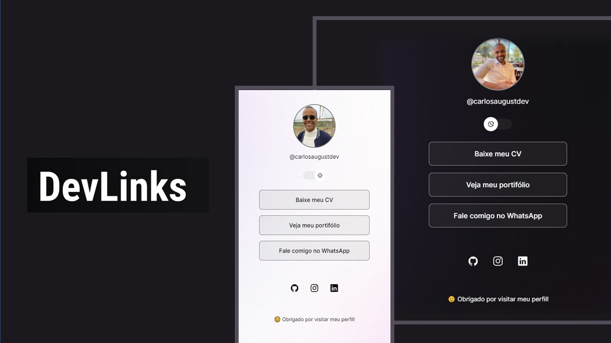

## 💻 Aboult the project

<h3>🔗DevLinks</h3>

DevLinks is a link aggregator to use as an online business card.

- [Access the finished project, online](https://carlosaugustdev.github.io/Dev-Link/)

  

## 🎨 Layout

The application layout is available in Figma:

## 🛠 Technologies

The following tools were used in building the project:

- [HTML][html]
- [CSS][css]
- [Javascript][javascript]
- [Git](https://git-scm.com)
- [Figma](https://www.figma.com/)

## 📍 Recommended Tools

- [VSCode](https://code.visualstudio.com/)

## 🤜🤛 Acknowledgment

-[Rocketseat for the complete and free course](https://lp.rocketseat.com.br/devlinks/inscricao?utm_source=github&utm_medium=descricao&utm_campaign=capture-devlinks&utm_term=organic&utm_content=descricao-github-mayk-brito))

## 📝 License

This project is under the MIT license.

Made by Carlos Augusto 👋🏽 [contact!](https://www.linkedin.com/in/caugusto-ribeiro/)

[html]: https://developer.mozilla.org/en-US/docs/Web/HTML
[javascript]: https://developer.mozilla.org/en-US/docs/Web/JavaScript
[css]: https://developer.mozilla.org/en-US/docs/Web/CSS
